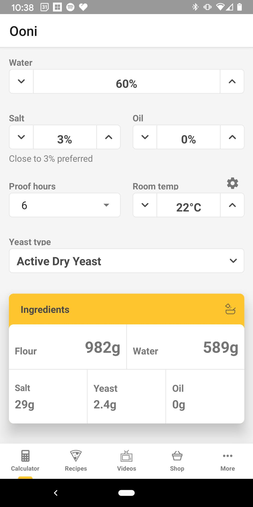
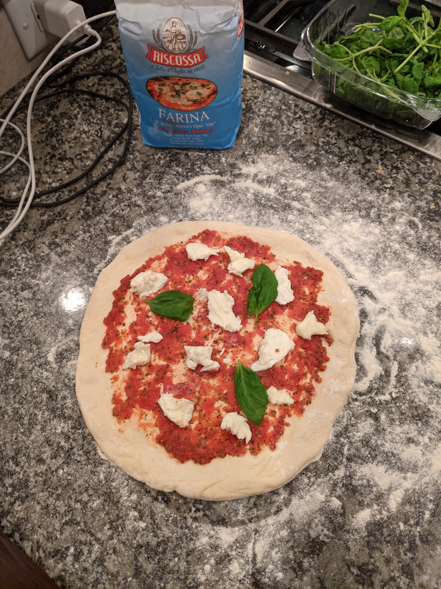

# My Neapolitan Style Pizza Process

In 2016 I got by first backyard pizza oven, the Uuni (now Ooni) 2S. Since then, I have enjoyed making pizzas with friends and family. Now that these ovens are becoming more common, I have had multiple people ask me about recipes and the techniques I use, so I have decided to compile them into this online resource so they are easier to share. I hope you enjoy!

___

I'm assuming that you have already got your hands on a pizza oven before reading this, but before we get to the recipes, I will go over some of the supplies that I use. You may not need all of these items, but if you are going to be making pizzas frequently and want to get consistent results, then these are the ones that I recommend:

## Equipment

1. A digital scale that can weigh items to 0.1 or 0.01 grams.
    
    - You will need the high precision to weigh the light ingredients like the yeast. As you get more experience you will also want to play with the ratios of water to flour so you will want to measure your ingredients by weight rather than by cups or tablespoons. 

2. Digital infrared thermometer that can measure up to 500 degrees Celsius (932 degrees Fahrenheit).

    - This will come in handy measuring the temperature of your pizza stone in your oven. 

3. Pizza peel (one should have come with the oven).

4. Stand mixer with dough attachment.

    - You can make the dough by hand kneading it, but I find it much easier to use a mixer with a dough attachment.

5. A fine mesh strainer if you want to make your own sauce.

6. A container and/or pan for the dough to rise in. 

    - During the bulk stage of the dough rise, you can leave the dough in a bowl covered with saran wrap, but once you divide it up into individual dough balls for the pizzas, you will need either a baking sheet with saran wrap covering everything, or you could use a proofing tray with a lid. I haven't bought a proofing tray yet, but it's on the list of items I would like to get. 
___

## Dough Ingredients

1. Type 00 (double zero) flour  

    - This type of flour allows the dough to form strong gluten bonds that allow it to be able to be stretched thin for the pizza base. I usually use a 1 kg bag to make 8 pizzas. 

2. Yeast (I use active dry yeast)

    - Different recipes will use either fresh yeast, active dry yeast, or instant yeast. I have only ever used active dry yeast since that is the first one I bought. Until I try the others, the recipes I share will stick to the active dry yeast. 

3. Salt

4. Water (warm temperature to activate the yeast)

    - The water will need to be warm to activate the yeast, but not too hot. One method I have seen in the Ooni recipes is to measure all the water as cold tap water, then boil one third of it. When you combine it all back together, the proper temperature will be reached. I have tried this method, and I have also just used water that wasn't too hot for my hand and both have worked for me. 

5. Semolina flour for dusting the pizza peel (optional)

    - Before you put your pizza on your peel, you will need to put a dusting of some sort of flour on the peel to prevent the pizza from sticking to it. I put this item as optional because you can just use regular flour for this. The semolina flour doesn't burn as easily as regular flour, so you won't get as much of the burnt flour taste on your pizza if you use this. 

6. Olive oil.

    - The olive oil is for greasing the containers/pans that the dough sits in to rise. I also brush it on the outside surface of the dough balls while they rise to prevent them from drying out. 

## Toppings

#### Cheese

- I get my cheese from an italian grocery store. It is the fresh fior di latte mozzarella cheese you get as large balls that sit in brine. Another alternative I have used is the same type of cheese that comes pre-packaged from Costco. I like both of them. I usually get one large cheese ball for 3-4 pizzas. 

#### Sauce 

- I have only tried two different sauce recipes, but I like a certain one so much that I just stick to it. I will share the link to the sauce recipe later on. Using premade sauce works as well, but I would try to find one that is an uncooked sauce, or at least a sauce from an italian market. Regular pizza sauce off the shelf at a normal grocery store probably wouldn't be that good. 

#### Other Toppings

- Fresh basil leaves
- Your favorite meats (I like a spicy genoa salami or prosciutto from an italian deli.)

___

## Recipes

#### Dough Recipe

- If you don't have a scale or don't want to measure out the ingredients by weight, then this is a good beginner dough recipe:
[No scale dough recipe](https://1drv.ms/b/s!AphyVVKBHcOagcprI5mXOKVcWFaR3A?e=hjpH5q "No Scale Dough Recipe")

- If you have 24-72 hours to do a cold proof, then I like this recipe from Ooni: [Ooni cold proof pizza dough recipe](https://ooni.com/blogs/recipes/cold-prove-pizza-dough "Ooni cold proof pizza dough recipe"). A cold proof is supposed to give a better flavour to the dough, but I don't notice a huge difference. 

- I have recently tried using Ooni's dough calculator on their phone app and I have enjoyed it. I found that the yeast amounts seemed off for cold proofing dough for shorter times like 24 hours, but it seemed accurate for doing same day dough. I will walk you through the process of making same day dough using the app. 
    -  If you scroll down to the bottom of the ooni [home page](https://ooni.com/?gclid=Cj0KCQiAoab_BRCxARIsANMx4S79jautVC8CwdMAbzArlk5Ps2qGOD3FC_w_tlkM_eCIyR0oAfPJpdMaAhuREALw_wcB "ooni website") you will see the link for downloading the app.
    
    - Here is a screenshot of the dough calculator recipe I would recommend using. The screen cut off the amount of dough balls, but this one was for 8 dough balls each weighing 200 g:

    

- Here are my usual steps for making this kind of same day dough:

1. Use half the warm water and add yeast to it for 5 min to activate the yeast and dissolve the salt in the other half of the water. 

2. After the yeast is activated, add flour, salt/water mixture, and yeast/water mixture to a stand mixer bowl with dough attachment and mix to 15-20 mins. 
    - The dough should be smooth and stretchable at this point. If it still feels tough, you can let the dough rest for 10 min and then mix it for another 5 min if need be. This resting period softens up the dough. 

3. Let the dough rise for about 45 minutes in the bowl with saran wrap covering it, or in another covered container. I grease the container with olive oil to prevent the dough from sticking to it. 

4. Divide the dough into 8 equal sized balls (each should be 200 g) and fold them over. Here is a good video that shows how to do it: [dough forming video](https://youtu.be/VusTc9DnqOA "dough ball video")

5. Place the balls on an olive oil greased cookie sheet (or proofing tray). Brush a thin layer of olive oil over the surface of the dough balls to prevent them from drying out. Cover with saran wrap (or the lid of the proofing tray)

6. Let the dough balls rise for 4-6 hours (they should almost double in size). Now you can start making your pizzas!

**One note about using this dough calculator:**
- This recipe uses 60% hydration (percentage of water compared to flour). This makes a dough that is easy to handle and it works well. As you get more experience handling the dough, you can bump up the hydration level. I like a 65% hydration dough. The higher hydration makes for a lighter crust with more air bubbles when it comes to cooking. The higher hydration does make it harder to handle the dough since it is sticker and tears more easily. 

#### Tomato Sauce Recipe

- Here is a link to my favorite sauce recipe. I haven't tried many, but people seem to love this one. It doesn't make very much sauce, so I always end up doubling, or even quadrupling this recipe. For 4 pizzas I would double the recipe. 

- [red sauce recipe](https://1drv.ms/b/s!AphyVVKBHcOa8jieZ5Kp76WG2Q_I?e=J7gqZ9 "red sauce recipe")

- You will need a fine mesh strainer for this recipe. 

___

## Making the Pizzas

Now that you have all the ingredients and the dough ready, it's time to make your pizza. I will walk through the steps I take here:

1. Flour your counter that you will be stretching the dough on. You can use this video to learn how to stretch the dough: [dough stretching video](https://youtu.be/Entzcl8q7H4 "dough stretching video")

    - **IMPORTANT:** Be sure to have a good amount of flour (or semolina flour) under your dough before you start adding toppings. I often make the pizza right on the peel, but whether you make it on the peel, or on the counter, you need enough flour under the pizza so it can slide on and off the peel. Once you start adding toppings, the dough will stick to the peel or counter if you don't have flour under it. 

2. Add the sauce. You don't need as much sauce as you think. I usually only use 1-2 heaping tablespoons. As the pizza cooks, the liquid from the cheese mixes with the sauce and so if you have too much sauce, your pizza will seem watery. 

3. Add the cheese. Again you don't need as much as you think. The chunks melt and spread out a lot as the pizza cooks. 

4. Add the meat and a few basil leaves. 

Here is a photo of what the pizza looks like before cooking:

## The Cook

This part will be highly specific to your oven, so you will have to do some trial and error to get things how you like them. The infrared thermometer comes in handy here to help you figure out what temperature of your stone is best for cooking. 

I use the Ooni Koda 12 pizza oven. It runs on propane, so it gives a consistent, steady heat. Mine takes about 20-30 minutes to preheat. 

I used to try to get it as hot as I could, but I have found that the stone was too hot at the back near the flame, so part of the crust would get this brown look to it and it would taste very burnt. I have started to leave my stone a bit cooler and it has been working better. 

I try to have the center of the stone be about 350-400 degrees Celsius. I was getting the burning when it was at 425-450 degrees. You can also cook the pizza more towards to opening of the oven if you want a cooler stone since the temperature varies greatly based on your distance from the flame. 

I usually leave my flame on full blast (or whatever I had it at during preheating which is medium-high) during the cook. I basically treat the pizza like a square and cook all four sides. The first side cooks for 20-30 seconds, and the others for about 15-20 seconds each. I slide the pizza out each time to rotate it, but you can also get a small turning peel that allows you to turn the pizza inside the oven. 

For my ideal cook. I like to see black "leopard spots" on the whole base of the pizza and around the crust. It's also nice to see some air bubbles form in the crust around the edge. 

I don't have any great pictures showing the base after a cook, but here is one that shows the crust, and the base should look similar: 

The pizza above was made using a lower hydration dough. With the higher hydration, the rim of the crust puffs up better with more air bubbles. I will try to add some more pictures soon. 

I hope you enjoy making your pizzas as much as I do!

- Connor Fairbanks
- Last updated December 28, 2020. 
    